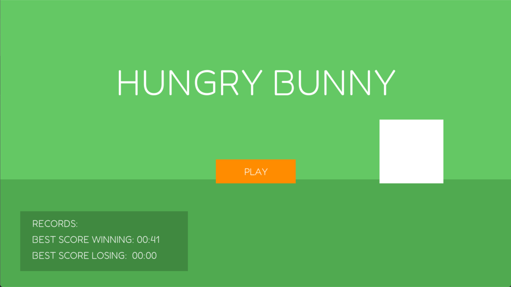

** Hungry Bunny - 2D Game

** Project Overview

Hungry Bunny is a simple 2D survival game developed for fun and learning purposes.  
The goal of this project was to explore basic game development concepts while improving my programming skills in C++.

** Game Objective

The player controls a white bunny.

The objective of the game is to fill the survival bar in the shortest time possible while eating only the correct carrots.

Eating the wrong items will reduce the bunny's health and may result in **Game Over**.

** Controls

Use the arrow keys to move the bunny:

- **Up Arrow** → Move Up  
- **Down Arrow** → Move Down  
- **Left Arrow** → Move Left  
- **Right Arrow** → Move Right 
 

** Technical Details

Programming Language: C++

Libraries Used: SDL2 libraries

** Requirements

To run the game, you need:

- C++
- SDL2.dll
- SDL2_mixer.dll
- SDL2_image.dll
- SDL2_ttf.dll

these files are required for the game to launch.

** How to Run the Game

1. Download or clone the repository.
2. Ensure that the SDL libraries are placed in the same directory as game.exe.
3. Run the executable file game.exe

The game window should open and you can start playing.

## Screenshot

** Author

- Assiya Aouinate
